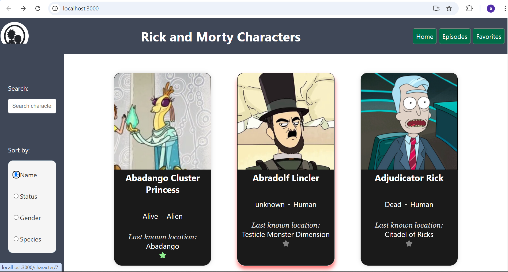
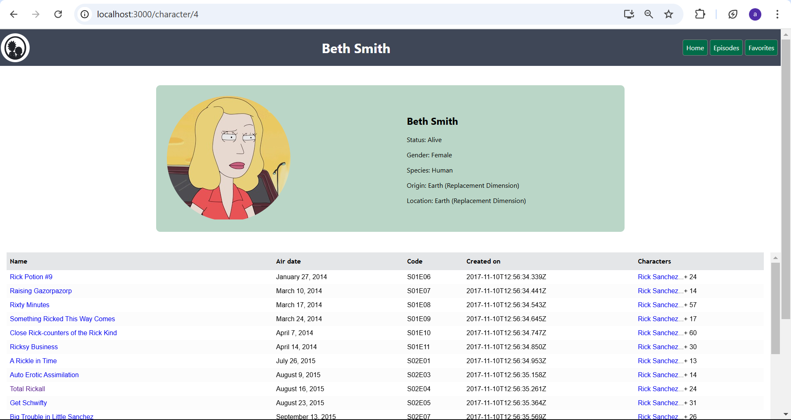
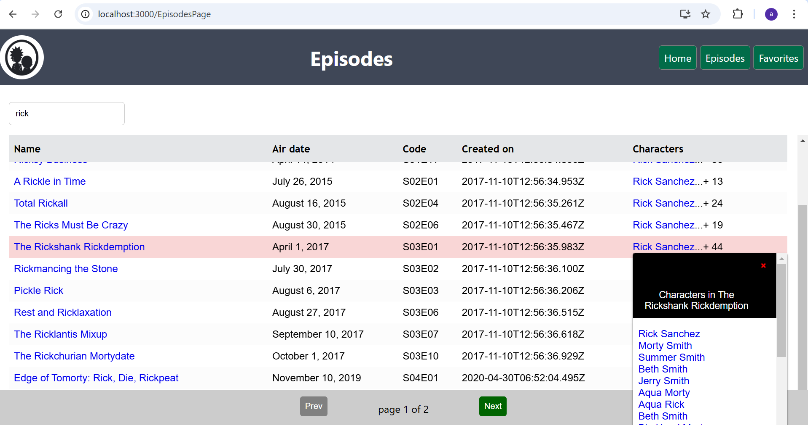
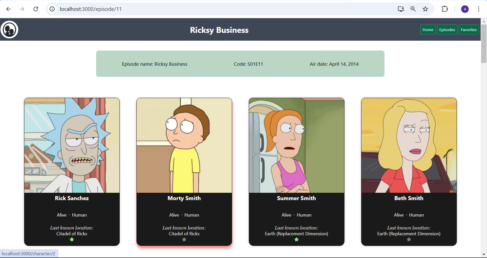
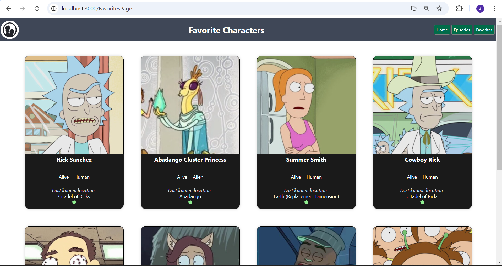

# Rick and Morty UI

Welcome to my **Rick and Morty UI** project! This project is a user interface inspired by the popular animated series "Rick and Morty." It features three main pages: Home, Episode, and Favourites. This README will guide you through the project setup and features.

## Table of Contents

- [Features](#features)
- [Screenshots](#screenshots)
- [Installation](#installation)
- [Usage](#usage)


## Features

- **Home Page**: A landing page that introduces the Rick and Morty universe and provides navigation to other sections.
- **Episode Page**: A detailed view of episodes, including descriptions, air dates, and characters featured in each episode.
- **Favourites Page**: A personalized page where users can save their favorite episodes for quick access.

## Screenshots

### Home Page



### Episode Page



### Favourites Page



## Installation

To get started with the Rick and Morty UI project, follow these steps:

1. **Clone the repository**:
   ```bash
   git clone https://github.com/AbhishekKandel/rickAndMorty-react.git
   ```

2. **Navigate to the project directory**:
   ```bash
   cd rickAndMorty-react
   ```

3. **Install dependencies**:
   ```bash
   npm install
   ```

## Usage

To run the project locally, use the following command:

```bash
npm start
```

This will start the development server, and you can view the application in your browser at `http://localhost:3000`.


---

Thank you for checking out this Rick and Morty UI project! If you have any questions or feedback, feel free to open an issue or reach out. Enjoy exploring the multiverse!